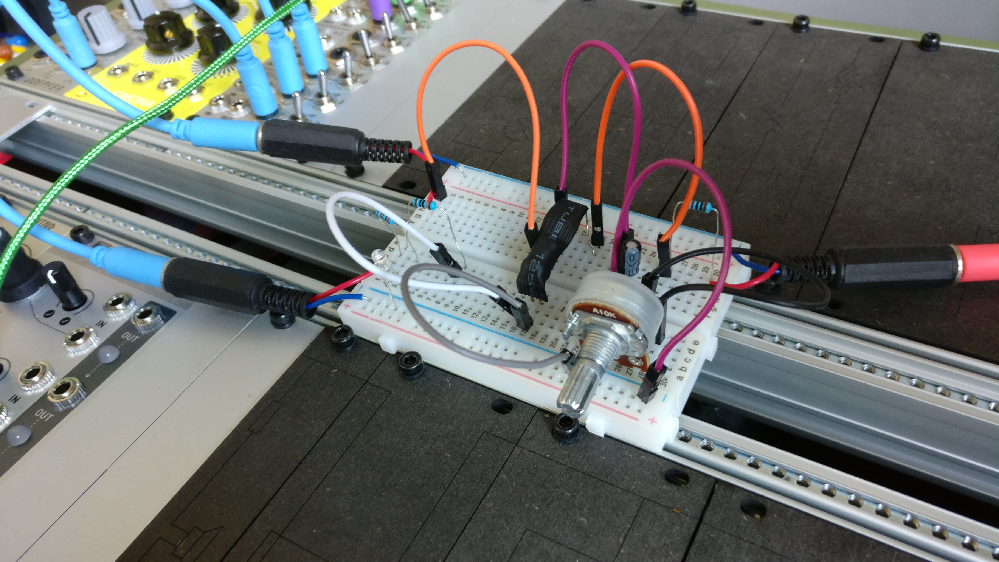

# 1U LPG

A simple passive low-pass gate with -6dB slope in a small 1U package.

status: design

## About

This low-pass gate (LPG) module design was inspired by the Two Tone module from [Ben Moren](http://benmoren.com/) as well as [Ken Stone's LPG](https://www.cgs.synth.net/modules/lpg.html). The original "Two Tone" LPG can be found [here.](https://github.com/bmoren/two-tone). The filter is 2nd order RC filter (the LDRs in the vactrols being the R), so it has a filter slope of -6dB.

I made this into a single LPG in a small 1U module, because I figured it would be nice to have a couple of them handy in my utility row. Note that I've design them according to the [Intellijel 1U specification.](https://intellijel.com/support/1u-technical-specifications/)

## Remarks

You can also put in a 4 pin (single LDR) vactrol for a 1st order filter characteristic. In this case, solder the resistor side of your Vactrol to the outer (odd) pins on the PCB; do not use the middle pin (pin 4). In this case, C1 can also be ommitted as only C2 will be used.

It is not recommended to put more than two of these LPGs in series as the input impedance might get too high to handle for some buffers in your system. 

## BOM

| Component | Quantity    | Component     |
| :------------- | :------------- | :------------- |
| RV1 | 1 | 9mm pot or Song Huei tall trimmer pot, A10k |
| J_? | 3 | Thonkiconn mono jacks |
| D1 | 1 | 3mm LED (I use white ones) |
| C1,C2 | 2 | Capacitor (ceramic or film) , 10nF - 0.1uf recommended. |
| R_VAC_1 | 1 | 100k ohm resistor (depends on U1 Vactrol) |
| R_LED_1 | 1 | 20k ohm resistor (depends on D1 LED) |
| U_1 | 1 | DIY (or bought) VTL5C3/2 vactrol |

## Building order

By no means a build guide; just a suggested order to make building easier.

1. Start soldering with the resistors on the back (R_VAC,R_LED).
2. Solder the caps on the back (C1,C2).
3. Place the jacks, LED and pot on the front, but do not solder them.
4. Fit the panel onto the jacks and use the jack lugs to secure it.
   (optional) if you have flat top LEDs, use a piece of masking tape on the front to make the front LED sit flush.
5. Flip the whole thing over and solder the jacks, pot and LED.
6. Solder your Vactrol in place. If you can't properly reach the legs, remove the panel and after soldering put it back on.
7. DONE!

## Vactrols and calibration

I've DIY-ed my Vactrols using 5539 LDRs and "super bright" green 5mm flat-top LEDs. You can find a [build guide here.](../MakingVactrols) Values depicted in the BOM above were determined after experimentation and breadboarding in order to find out what works with my LDRs (hence the large value for R_VAC).

Steps for calibration (this is best done using a breadboard setup):

1. With the "tone" completely CW (filter open), hookup a plain oscillator output to the input and the output to your output device of choice.
2. Use a fixed voltage source to feed different voltages (0-10V) to the CV input.
3. At maximum voltage (let's say 10V) the oscillator should sound as loud as when you were to plug it into your output directly. If the output is significantly lower, you should lower your R_VAC.
4. Sweep the CV voltage manually to see when the maximum volume is reached. It should be almost at the end. Maxing out to soon? Increase your R_VAC values.
5. At about 4-5V's the volume at the output should be about half (perceived) of what you get as maximum.

### More on DIY vactrol

Aside from our own build guide, there are some good online tutorials about this (shamelessly copied from the Two Tone github page):

<http://guitarpcb.com/PDF%20Files/DIY%20Vactrol.pdf>

<https://www.youtube.com/watch?v=Je5FS1A7Ys0>

<https://www.youtube.com/watch?v=Ch9w5JtbZSc>

<https://www.youtube.com/watch?v=VZ1B0Epr770>
