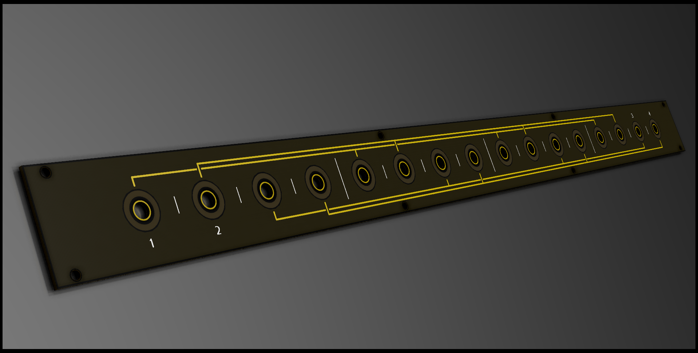

# 1U Bus

Bus for the distribution of CV signals. In essence just a very big passive mult with (active) signal indicators. Basically a simplified DIY Make Noise CV bus clone.

*prototyping*

## About

Like the other modules in the 1Utilities series, this module is designed according to the [Intellijel 1U specification.](https://intellijel.com/support/1u-technical-specifications/). This one spans 104 hp width in your case.

## Remarks

It's big? There's still 4 busses with 4 in- or outputs. Like with a passive mult, any jack can be in or out; **just make sure you have one (1) and only one (!) input.** Having multiple inputs could damage your modules (connecting outputs with outputs).

Even though this module multing is passive, it still requires power to run the signal indicators. Makes for a pretty light show too. The values of the resistors in the design assume Red/Green/Blue/White leds for channels 1 to 4 respectively. You can of course substitute your own led/resistor values to taste!

## BOM

| Component | Quantity    | Component     |
| :------------- | :------------- | :------------- |
| J1 | 1 | 2x5 male header pins (2.54mm pitch), boxed or plain | 
| U1 | 1 | TL074 OpAmp |
| U2-U17 | 16 | Thonkiconn mono jacks |
| C1,C2 | 2 | 10uF (>25V) polarized capacitors |
| C3,C4 | 2 | 100nF capacitors |
| D1,D2 | 2 | 1N4001 diode|
| D_POS_?_? / D_NEG_?_? | 32 | 3mm LEDs (use same color for positive and one for negative) |
| R_Fuse_? | 1 | 10R ohm resistors |
| R_Split_?_1 | 4 | 10k ohm resistors for scaling input signal to indicator |
| R_Split_?_2 | 4 | 1k ohm resistors for scaling input signal to indicator |
| R_LED_1_? | 1 | 1k ohm resistors (depends on LEDs) |
| R_LED_2_? | 1 | 470R ohm resistors (depends on LEDs) |
| R_LED_3_? | 1 | 5k1 ohm resistors (depends on LEDs) |
| R_LED_4_? | 1 | 5k1 ohm resistors (depends on LEDs) |

## Building order

Nothing to see here yet.