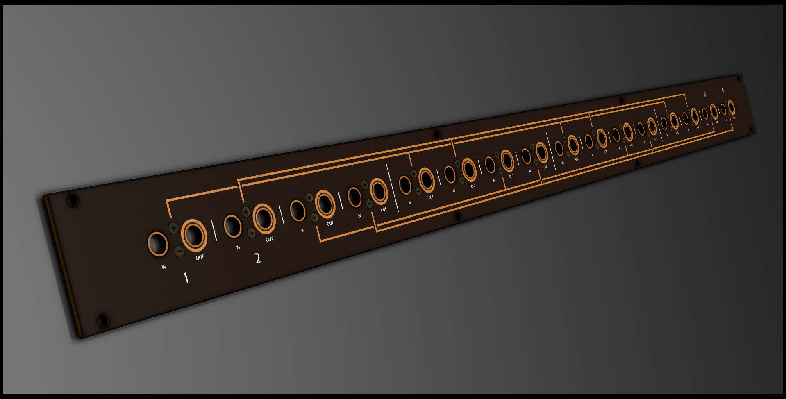

# 1U 4x4/4 Bus

Bus for the distribution of CV signals. In essence just a very big 4 times 4-in/4-out mult with signal indicators. Basically DIY Make Noise CV bus clone meets Links.

*prototyping*

## About

Like the other modules in the 1Utilities series, this module is designed according to the [Intellijel 1U specification.](https://intellijel.com/support/1u-technical-specifications/). This one spans 104 hp width in your case.

## Remarks

It's big? There's still 4 busses with 4 inputs and 4 outputs. You can use multiple inputs to combine signals (triggers, lfo's) like you would with an averager mixer and distribute these signals around your case.

The values of the resistors in the design assume Red/Green/Blue/White leds for channels 1 to 4 respectively. You can of course substitute your own led/resistor values to taste!

## BOM

TODO: revise

| Component | Quantity    | Component     |
| :------------- | :------------- | :------------- |
| J1 | 1 | 2x5 male header pins (2.54mm pitch), boxed or plain | 
| U1 | 4 | TL074 OpAmp |
| U2-U17 | 16 | Thonkiconn mono jacks |
| C1,C2 | 2 | 10uF (>25V) polarized capacitors |
| C3,C4 | 2 | 100nF capacitors |
| D1,D2 | 2 | 1N4001 diode|
| D_POS_?_? / D_NEG_?_? | 32 | 3mm LEDs (use same color for positive and one for negative) |
| R_Fuse_? | 1 | 10R ohm resistors |
| R_Split_?_1 | 4 | 10k ohm resistors for scaling input signal to indicator |
| R_Split_?_2 | 4 | 1k ohm resistors for scaling input signal to indicator |
| R_LED_1_? | 1 | 1k ohm resistors (depends on LEDs) |
| R_LED_2_? | 1 | 470R ohm resistors (depends on LEDs) |
| R_LED_3_? | 1 | 5k1 ohm resistors (depends on LEDs) |
| R_LED_4_? | 1 | 5k1 ohm resistors (depends on LEDs) |

## Building order

Nothing to see here yet.
