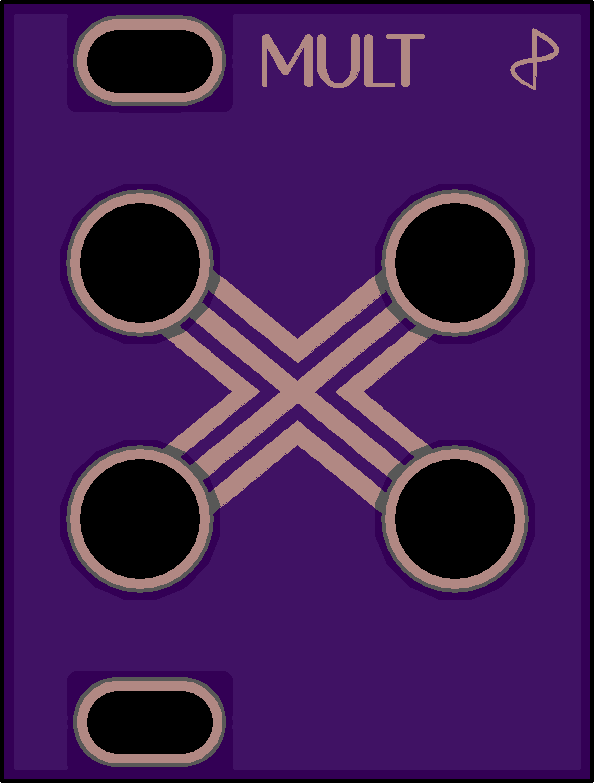

# 1U Mult

Dead simple passive multi. Its only feature being very small.

*status: boards on order (30 aug 2018)*

## About

Like the other modules in the 1Utilities series, this module is designed according to the [Intellijel 1U specification.](https://intellijel.com/support/1u-technical-specifications/)

## Remarks

It is a multiple? There are many like it, but this one is mine?

Nothing fancy or noteworthy. It is only 6hp and an easy build.

## BOM

| Component | Quantity    | Component     |
| :------------- | :------------- | :------------- |
| J_? | 4 | Thonkiconn mono jacks |
| D? | 2 | 3mm LED (use one color for positive and one for negative) |
| R_LED_? | 2 | 1k ohm resistors (depends on LEDs) |

## Building order

Nothing to see here yet.