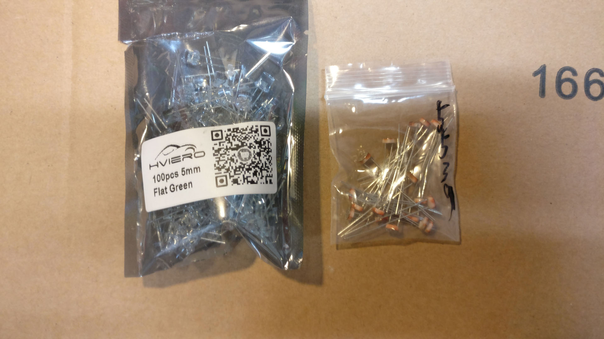
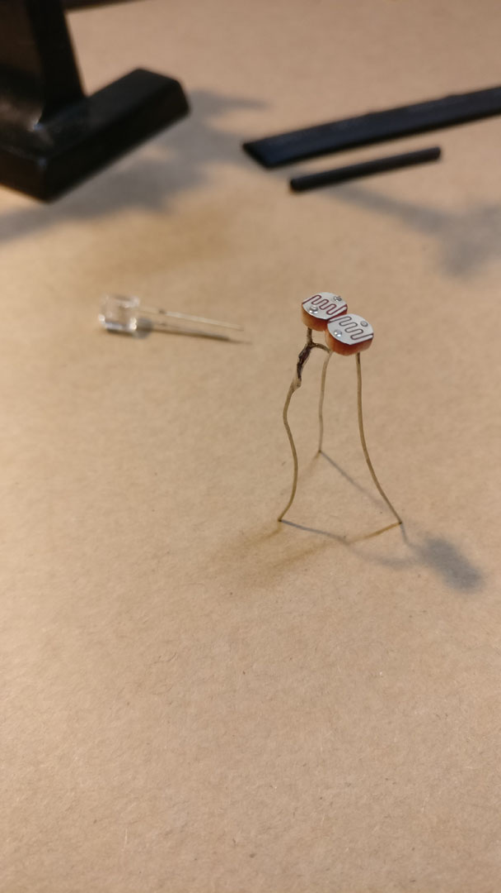
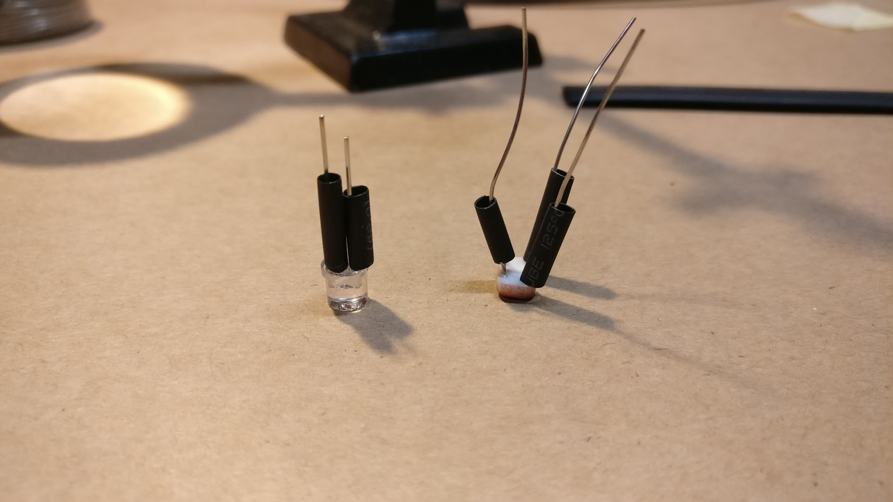
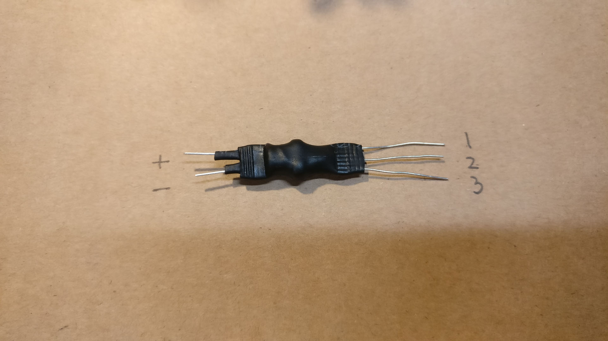

# Making your own vactrols

A short visual guide for easy crafting of 4- or 5-pin vactrols. Why spend €€€'s or $$$'s on ready-made vactrols when you can very easily craft your own!?!

## BOM

All you need is some time, a flat surface to work on, and some simple components. Here's the stuff you need:

| Item | Description |
| :----- | :---------- |
| 5mm flat-top led | A super-bright green LED with a flat top |
| 5539 LDR | Light Dependant Resistor |
| Heatshrink | In two sizes |
| Tape | A piece of masking tape and some isolation tape |
| Solder and a soldering iron | To solder (genius!) |

Which looks like this:

## Step-by-step

The most common DIY vactrol would be 1 LED and 1 LDR (like the VTL5C3). However, since our 1U LPG uses a 5-pin vactrol (like the VTL5C3/2), which consists of 1 LED and 2 LDRs, we are going to show making that one. The steps are all the same regardless the number of LDRs you stick on the LED. except of the soldering of LDR legs, of course.

### 1. Preparing the LDRs (skip if you are only using one LDR)

First, place both LDRs face down on the sticky side of a piece of masking tape, making sure that the are nicely aligned. This makes it easier to connect the two legs.

Twist the legs on one side to put the LDRs in series. Solder and clip off one of the legs (NOT BOTH!).

Your LDR assembly should now be a tripod.

### 2. Preparing the legs

Add small heatshrink tubes (about 1cm/0.5" in length) to the legs of your components.

Heat them so they are shrunken. They might still be a loose fit, but that is OK. The tubes are to avoid shorting when you bend the pins of the vactrol. Just make sure they don't slip off during the rest of the build.

### 3. The actual mariage of LDRs and LED

Align the head of the LDR tripod and the LED. The LED should be right in the middle of the two LDRs. Using a third hand (even a cheap one) can help you loads here.

Use a piece of the isolation tape to stick the LED and LDR-assembly together. Isolation tape is recommended because it is nice and dark.

Cut a piece of the large heatshrink tubing. Make sure it is as big or only a little shorter that your assembly (I prefer a little shorter so you can still see the individual tubes on the legs)

Push your assembly into the tube. With the tape applied, it should be snug. It is probably the most convenient to push the LDR assembly with the LED (so LDR legs in first). If you are really confident, you could skip the tape step and push the LED and LDR assembly into the tube directly. Just be sure to check the alignment of the components.

When the components are in the middle of the tube, check the order of the LDR assembly legs. They should go from left-to-right (or rather the middle pin is the middle pin).

Apply heat to the tube and shrinkwrap your vactrol. Use pliers to press down on the ends the tube, sealing them (if they are still warm enough).

All said and done, your end product should look a little like this. Bending the legs (up or down, depending on your application) will help keeping the light out. Just be sure to bend where the legs are covered by the heatshrink, not the exposed legs. This adds structural support and because the heatshrink tubes is folded, the fold blocks out ambient light.

### 4. (almost) Done!

Congratulations, you have made a vactrol.

Be sure to test it before soldering it to a pcb! apply a voltage to the LED and measure the resistance between the pins: 0V = XX MOhm, 2V (depends on the LED; CAREFUL not the burn it out) = XX Ohm (maybe 1KOhm; it depends on what LDRs you've used).
