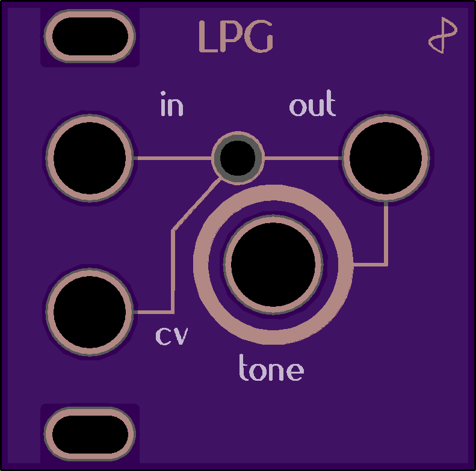
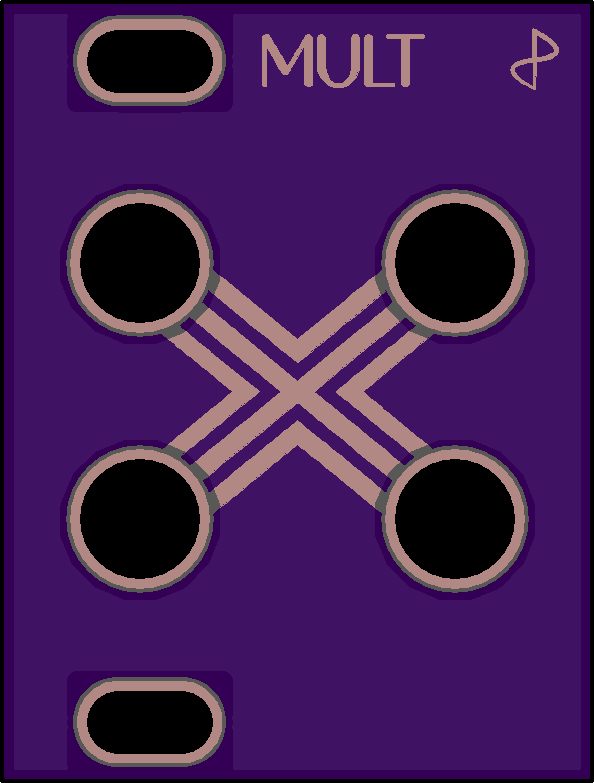

# EurorackModules

Open-source eurorack synthesizer modules. All our schematics and pcbs are developed with [KiCad.](http://kicad-pcb.org/)

## 1Utilities modules

These are simple (passive) utility modules, designed to fit the Intellijel 1U spec. They are often smaller (6 or 8HP) so you can use them to fill gaps in your system.

| | Module | Description |
| --- | :----- | :---------- |
|| [LPG](1Utilities/1U_LPG) | A simple passive low-pass gate with -6dB slope in a small 1U package. |
|| [Mute](1Utilities/1U_Mute) | A signal mute (momentary and latching) in a convenient 1U package.|
|| [Mult](1Utilities/1U_Mult) | Dead simple passive multi. Its only feature being very small. |

## Regular (3U) Modules

Just your regular sized eurorack modules.

| | Module | Description |
| --- | :----- | :---------- |
|| [Aphelion](Aphelion) | A dual-band parametric compressor that uses vactrols. |
|| [Binary Pulsar](BinaryPulsar) | A dual wide range voltage controlled low-frequency oscillator. |
|| [Corona](Corona) | A multi purpose vacuum tube (or valve) drive module with feedback control. |

## Other stuff
| | Thing | Description |
| --- | :----- | :---------- |
|| [PSU Companion](PSUCompanion) | A companion for Bel / Condor / Power One linear power supplies. Goes inbetween the PSU and your busboards. |
|| [Making Vactrols](MakingVactrols) | A little tutorial on making your own vactrols. |
