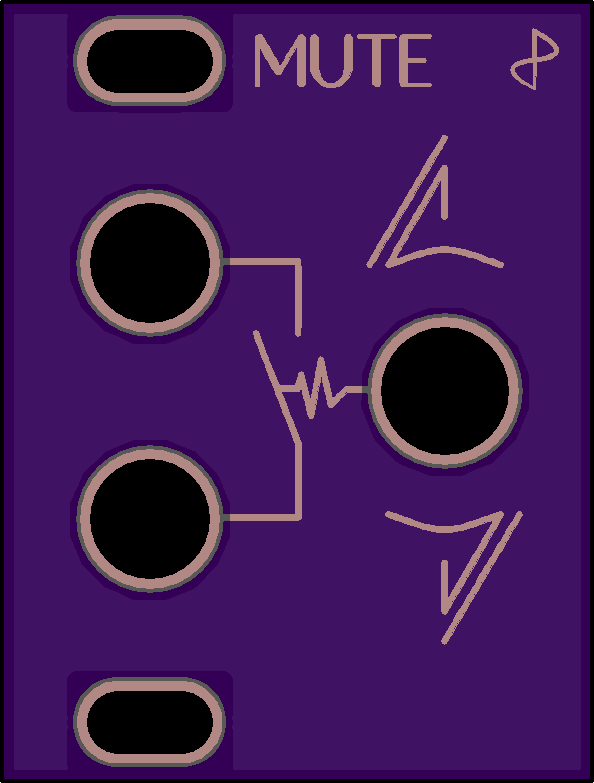

# EurorackModules

Open-source eurorack synthesizer modules. All our schematics and pcbs are developed with [KiCad.](http://kicad.org/)

## 1U modules

These are simple (passive) utility modules, designed to fit the Intellijel 1U spec. They are often smaller (6 or 8HP) so you can use them to fill gaps in your system. Except for the Multibus... that one takes up an entire row.

| | Module | Description |
| --- | :----- | :---------- |
|| [LPG](1Utilities/1U_LPG) | A simple passive low-pass gate with -6dB slope in a small 1U package. |
|| [Mute](1Utilities/1U_Mute) | A signal mute (momentary and latching) in a convenient 1U package.|
|| [Mult](1Utilities/1U_Mult) | Dead simple passive multi. Its only feature being very small. |
|| [Multibus](Multibus) | A eurorack module for the distribution of CV signals. |

## Regular (3U) Modules

Just your regular sized eurorack modules.

| | Module | Description |
| --- | :----- | :---------- |
|| [Corona](Corona) | A multi purpose vacuum tube (or valve) drive module with feedback control. |

## Other stuff
| | Thing | Description |
| --- | :----- | :---------- |
|| [PSU Companion](PSUCompanion) | A companion for Bel / Condor / Power One linear power supplies. Goes inbetween the PSU and your busboards. |
|| [Making Vactrols](MakingVactrols) | A little tutorial on making your own vactrols. |
