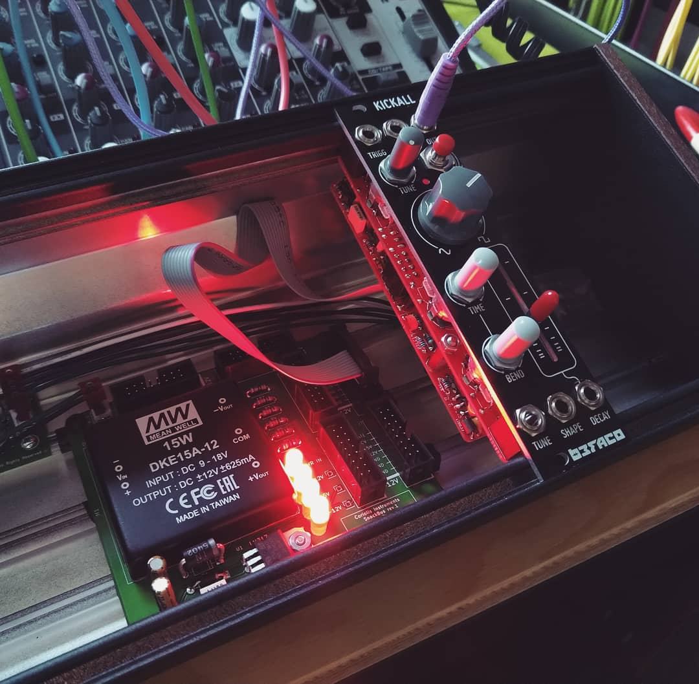

# SnackBus PSU

A small, easy to DIY, power supply for Eurorack modules. Designed to be used in a surplus Moog Mother-32 or DFAM skiff, utilizing the existing wall-wart and internal connector. Add some spacers as feet and you can also use it as a benchtop power supply for your eurorack breadboarding experiments.

*status:* build and tested

*current revision:* 2

## About

This power supply was design as a even lower-cost, even smaller, alternative to the excellent Befaco LunchBus skiff PSU. In terms of circuitry, the SnackBus is almost identical. Why use this? Well, the SnackBus fits into a Moog 60 HP skiff (from the Mother-32 or DFAM), whereas the LunchBus does not.

## On power output

The DKE15A-12 converter used is capable of delivering 625mA on both +12V and -12V (a total of 1250mA). When it does so, it required 1.7A @12V (20.4W) from the wall-wart.

Note that the Moog adapter, supplied with the Mother-32 and DFAM, will only put out 1A @12V. This means that if you use this adapter, the SnackBus will only be able to output 350mA on both rails. Less if you use 

**Our recommendation: do not exceed 300mA power draw** on either rails when using the Moog-supplied adapter with the SnackBus. Otherwise buy a beefier adapter.

## BOM

| Component | Quantity    | Component     |
| :------------- | :------------- | :------------- |
| R1 | 1 | 680R ohm resistor (for +5V in LED) |
| R2 | 1 | 1k ohm resistor (for -12V LED) |
| R3 | 1 | 1k ohm resistor (for +12V LED) |
| R4 | 1 | 5k ohm resistor (for PWR IN LED) |
| R5 | 1 | 1K ohm resistor (for 5V) |
| R6 | 1 | 330R ohm resistor (for 5V) |
| D1 | 1 | 1N5402 diode |
| D2 | 1 | 1N4004 diode |
| C1 | 1 | Capacitor (ceramic or film) , 100nF (104) |
| C2 | 1 | Capacitor, Polarized (electrolytic) , 10uF |
| C3 | 1 | Capacitor, Polarized (electrolytic) , 22uF |
| J1 | 1 | 2-pin Molex connector |
| J2-J9 | 8 | 16-pin (02x08) Shrouded IDC header |
| U1 | 1 | LM317T voltage regulator |
| M1 | 1 | MeanWell DKE15A-12 DC-DC converter |

All resistors 1% metal film.

## Building order

By no means a build guide; just a suggested order to make building easier.

1. Start soldering with the resistors.
2. Then the diodes.
3. Add the shrouded box headers. Use something flat to keep them in place when you flip the board around.
4. Do the C1 capacitor next.
5. Bend the leads of the LM317T 90 degrees down (the heatsink being the downside of the regulator) where the leads become thinner. Make sure the hole in the tab and on the board align. Add the regular by soldering the leads and screwing the tab to the board with an M3 bolt and nut.
6. Add the LEDs. Use a piece of masking tape the keep them in place.
7. Drop in the regular, flip the board and solder it from the backside.
8. Add the polarized caps C2 and C3.
9. Finally, add J1: the Molex connector. Using a piece of masking tape to fixate it on the board is recommended.
