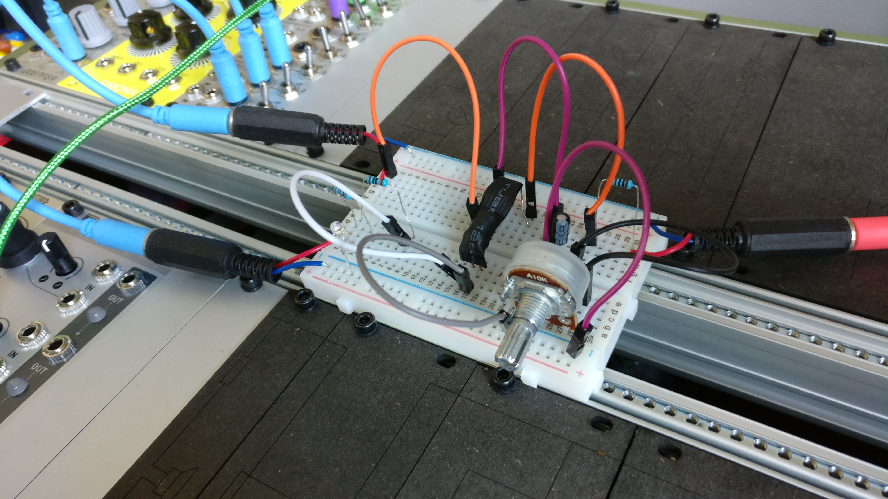

# TwoByTwo Tone
A simple quadruple passive low-pass gate with some normalizations.

status: prototype (boards ordered)

## About
This quad low-pass gate (LPG) module design is basically a dual-dual  LPG as designed by [Ben Moren](http://benmoren.com/). The original "Two Tone" LPG can be found [here.](https://github.com/bmoren/two-tone).

The TwoByTwo places two "Two Tone"s under one panel (hence the name) and on one PCB. It also adds normalization: it feeds the output of top-left into the top right input and routes the input cv of the top-left LPG to both. The same routing applies to the bottom two LPGs. This can be useful in order to get a steeper filter slope (2-pole) or apply two different tone settings to the audio signal.

## Remarks
It is not recommended to put more than two of these LPGs in series as the input impedance might get too high to handle for some modules in your system. So stick to the normaled halves, okay? :)

## BOM
| Component | Quantity    | Component     |
| :------------- | :------------- | :------------- |
| RV? | 4 | Song Huei tall trimmer pots, A10k |
| J_? | 12 | thonkiconn mono jacks |
| D?1 | 4 | 3mm LED's (I use White) |
| C? | 4 | Capacitors (polarize, electrolitic) , 1uf - 10uf. I use 10uF. |
| R_VAC_? | 4 | 100k ohm resistors (depends on Vactrols) |
| R_LED_? | 4 | 20k ohm resistors (depends on LEDs) |
| R_OUT_? | 4 | 1k ohm resistors |
| VAC_PHOTO_? | 4 | DIY or NLS-32 vactrol |

## Vactrols and calibration
I've DIY-ed my Vactrols using 5539 LDRs and "super bright" green 5mm flat-top LEDs. Values depicted in the BOM above were determined after experimentation and breadboarding in order to find out what works with my LDRs (hence the large value for R_VAC). 

Steps for calibration (this is best done using a breadboard setup): 

1. With the "tone" completely CW (filter open), hookup a plain oscillator output to the input and the output to your output device of choice. 
2. Use a fixed voltage source to feed different voltages (0-10V) to the CV input. 
3. At maximum voltage (let's say 10V) the oscillator should sound as loud as when you were to plug it into your output directly. If the output is significantly lower, you should lower your R_VAC.
4. Sweep the CV voltage manually to see when the maximum volume is reached. It should be almost at the end. Maxing out to soon? Increase your R_VAC values.
5. At about 4-5V's the volume at the output should be about half (percieved) of what you get as maximum.

### How to build a DIY vactrol:
There are some good online tutorials about this (shamelessly copied from the Two Tone github page):

http://guitarpcb.com/PDF%20Files/DIY%20Vactrol.pdf
 
https://www.youtube.com/watch?v=Je5FS1A7Ys0
 
https://www.youtube.com/watch?v=Ch9w5JtbZSc
 
https://www.youtube.com/watch?v=VZ1B0Epr770
